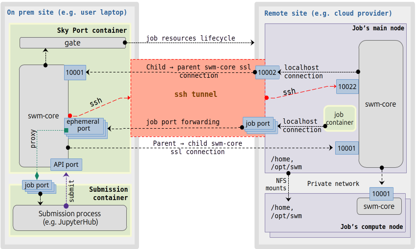

## Sky Port

**Sky Port** gives you **private HPC on demand**. You own the workload management.

Submit a job. Sky Port creates a private cloud cluster for that workload, runs your containers, moves data, monitors progress, and removes the resources when the job ends. You do not share a fixed cluster with other users. You get dedicated nodes for the life of the job.

Sky Port is open-source (BSD-3-Clause) and vendor-independent. It is built for [HPC workloads](https://en.wikipedia.org/wiki/High-performance_computing): multi-node MPI, GPUs, fast interconnects, and checkpoint-friendly runs. Open Workload is the community behind Sky Port.

[Quick start](#quick-start) · [HPC features](#hpc-features) · [Try Jupyter](https://github.com/openworkload/swm-jupyter-term) · [Source on GitHub](https://github.com/openworkload)

### Why Sky Port

* **Private HPC when you need it**: each job gets its own cloud partition and nodes; resources go away when the job finishes (unless you keep them for debug).
* **HPC-ready by design**: MPI over PMIx, GPU CDI, InfiniBand/RDMA attach, storage mounts, metrics, and optional checkpointing.
* **One workflow**: no separate steps to create VMs, forward ports, sync files, and clean up afterward.
* **You choose the resources**: pick container image, node flavors and compute node images (you pay the cloud provider directly).
* **Replaceable components**: Terminals (clients) and Gates (cloud connectors) speak documented REST APIs, so third parties can add user interfaces or cloud backends without forking the core.
* **Certificate-based trust**: Terminals, Core, and Gates authenticate with mutual TLS, not shared passwords.

### HPC features

* **MPI via PMIx**: start multi-node ranks with `swm-task --pmix`. Sky Port runs per-node `swm-pmix` and injects `PMIX_*` / `SWM_*` for MPI apps.
* **GPU integration**: request GPUs with `#SWM gpus`. NVIDIA devices enter the job container through CDI (hard fail if CDI is missing).
* **InfiniBand and RDMA**: when the host has IB/RDMA, Sky Port attaches it to job containers automatically (CDI or device nodes, plus memlock caps).
* **Storage automount**: attach cloud blob storage with `#SWM storage` directive for inputs, outputs, scratch filesystem and checkpointing.
* **Job monitoring**: Porter samples CPU, memory, and GPU (NVML) usage; Sky Port exports Prometheus metrics and a REST job metrics API.
* **Checkpointing**: optional DMTCP/MANA checkpoints for MPI jobs (`#SWM checkpoint dmtcp`).

See [JOBS.md](https://github.com/openworkload/swm-core/blob/master/HOWTO/JOBS.md), [CONTAINERS.md](https://github.com/openworkload/swm-core/blob/master/HOWTO/CONTAINERS.md), [ACCOUNTING.md](https://github.com/openworkload/swm-core/blob/master/HOWTO/ACCOUNTING.md), and [CHECKPOINTS.md](https://github.com/openworkload/swm-core/blob/master/HOWTO/CHECKPOINTS.md).

## Quick start

Pull the release container (Core + Gate):

```bash
podman pull openworkload/skyport:latest
```

From a [swm-core](https://github.com/openworkload/swm-core) checkout, start the Sky Port pod:

```bash
make start-release-container
# later: podman pod start skyport-pod
```

Talk to a running Core with the console terminal:

```bash
pip install swmconsole
swmconsole --help
swmconsole --job-list
```

## How you use it

1. **Interactive Jupyter notebooks**: [Jupyter terminal](https://github.com/openworkload/swm-jupyter-term) (`swmjupyter` on PyPI) spawns JupyterLab on private cloud VMs through Sky Port.
2. **Batch / scripted jobs**: write a `#SWM` job script and submit with [swm-console](https://github.com/openworkload/swm-console-term).
3. **Custom terminals**: build against the [Python client](https://github.com/openworkload/swm-python-client) (`swmclient` on PyPI) and the Core REST API.
4. **Your own cloud gate**: implement a Gate for your compute resources (Azure is the reference integration today).

### Job script sketch

```bash
#!/bin/bash
#SWM name example-mpi-job
#SWM nodes 3
#SWM gpus 1
#SWM flavor Standard_NC6s_v3
#SWM cloud-image ubuntu-hpc/2404
#SWM container-image ubuntu:24.04
#SWM storage swmblobcontainer
#SWM input-files data.dat
#SWM output-files results.out

export PATH="/opt/openmpi/bin:${PATH}"
swm-task --pmix ./run_my_mpi_app
```

Directives cover nodes, GPUs, flavors, images, storage, file transfer, ports, and checkpointing. Full reference: [JOBS.md](https://github.com/openworkload/swm-core/blob/master/HOWTO/JOBS.md).

## Software stack

| Component | Repository | Role |
|-----------|------------|------|
| Core | [swm-core](https://github.com/openworkload/swm-core) | Workload manager daemon: Terminal ↔ Gate orchestration |
| Scheduler | [swm-sched](https://github.com/openworkload/swm-sched) | Scheduler plugin: builds execution timetables |
| Gate | [swm-cloud-gate](https://github.com/openworkload/swm-cloud-gate) | Cloud provider integration (Azure) |
| Jupyter terminal | [swm-jupyter-term](https://github.com/openworkload/swm-jupyter-term) | JupyterHub spawner for Sky Port jobs |
| Console terminal | [swm-console-term](https://github.com/openworkload/swm-console-term) | CLI for jobs, flavors, images, and remotes |
| Python client | [swm-python-client](https://github.com/openworkload/swm-python-client) | Wrapper around the Core REST API |

## Design

Network connections between terminal, core, gate, and cloud provider:



## Supported platforms

Sky Port targets Linux on ARM64 and x86_64. A reasonable effort is made across major modern distributions, but validation is currently limited to recent Ubuntu on x86_64.

## Docs and contributing

* [Install](https://github.com/openworkload/swm-core/blob/master/HOWTO/INSTALL.md)
* [Containers (Podman, GPU, IB/RDMA)](https://github.com/openworkload/swm-core/blob/master/HOWTO/CONTAINERS.md)
* [Job scripts (MPI, storage, GPUs)](https://github.com/openworkload/swm-core/blob/master/HOWTO/JOBS.md)
* [Job metrics](https://github.com/openworkload/swm-core/blob/master/HOWTO/ACCOUNTING.md)
* [Checkpointing (DMTCP/MANA)](https://github.com/openworkload/swm-core/blob/master/HOWTO/CHECKPOINTS.md)
* [Azure setup](https://github.com/openworkload/swm-cloud-gate/blob/master/HOWTO/AZURE.md)
* [Build from source](https://github.com/openworkload/swm-core/blob/master/HOWTO/BUILD.md)

Bug fixes are welcome without prior discussion. For new features, gates, or terminals, [open an issue](https://github.com/openworkload/swm-core/issues) first.

Software is licensed under BSD-3-Clause. [Code of conduct](https://github.com/openworkload/swm-core/blob/master/CODE_OF_CONDUCT.md).
