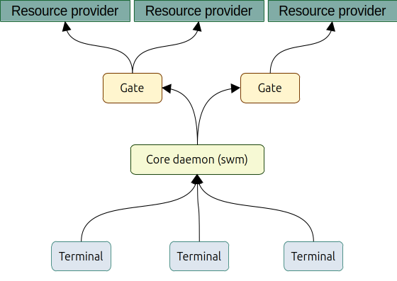
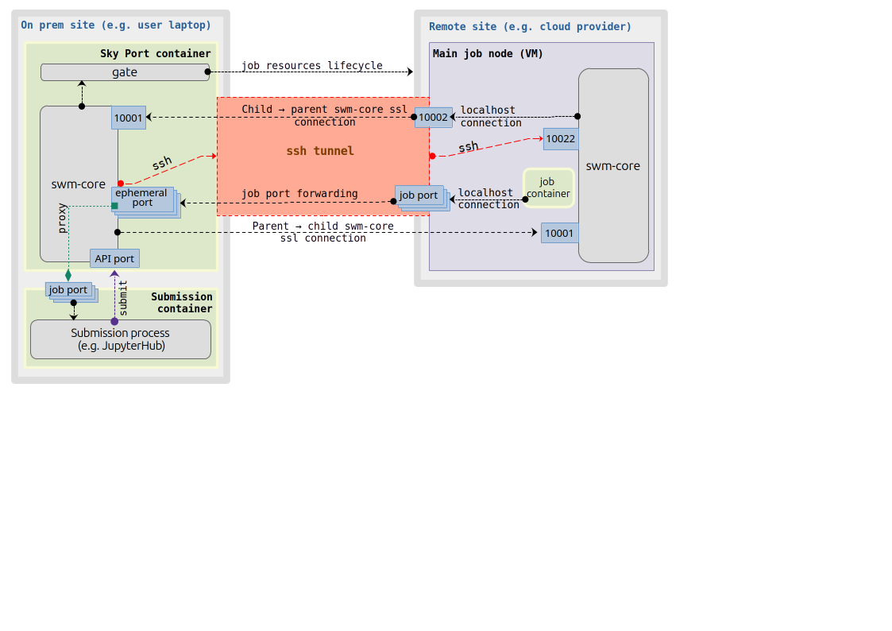

## Open Workload Project

Open Workload is a dedicated initiative focused on exploring innovative approaches to modern [High Performance Computing (HPC)](https://en.wikipedia.org/wiki/High-performance_computing) workload management. Comprised of software developers and HPC specialists, our objective is to refine and establish a universal interface for seamless connection between user applications and cloud resources. Our project, Sky Port, serves as an experimental workload manager that enables users and their software to access and interact with the global compute ecosystem.

We trust in:
* zero trust security approach,
* a diverse and distributed HPC future,
* rising demand for personal HPC computation.

Sky Port facilitates automated configuration of HPC clusters for each cloud-based job, providing users with comprehensive control over the entire lifecycle of their tasks. A workload management software allows the user to transfer demanding computational tasks to remote resources provided by a cloud service. The user selects which resources are used for her jobs and is responsible for covering the costs of those resources.

The difference between using Sky Port and the usage of a manually configured HPC clusters in a public cloud is amount of workload and cluster management automation. The former allows a user or user-controlled software to submit a new workload without bothering about mechanisms behind the data transferring, remote resources lifecycle and computational process. While the latter demands from the user additional knowledge and steps to create and configure an HPC clusters in the cloud, configure ports forwarding, transmit the user’s data, run the workload, and download the workload results back to the user’s laptop. Those steps usually can be automated, but they are typically either not integrated into a single seamless user workflow, implemented as a proprietary software or vendor locked.

Sky Port is an open-source vendor-independent workload manager designed for HPC workload. In particular the following funcionality is going to be implemented:

* Multi node jobs
* GPU jobs
* MPI
* OpenMP
* Checkpoints

## Supported platforms

Sky Port targets support for the Linux operating system. A reasonable effort is made to support all major, modern Linux distributions on ARM64 and X86_64 architectures. However, validation is limited to the most recent releases of Ubuntu/X86_64 systems.

## Current status

The [source code](https://github.com/openworkload) is currently in early (alpha) stage. The project requires some time for API stabilization.

## Source code

Sky Port software stack consists of the following repositories:
* [Core](https://github.com/openworkload/swm-core): the main component of Sky Port (workload manager). This daemon runs in the background and serves all communications among terminals and gates.
* [Scheduler](https://github.com/openworkload/swm-sched): workload scheduler (a plugin for the core daemon). It creates timetables for job execution.
* [Gate](https://github.com/openworkload/swm-cloud-gate): a plugin for Sky Port that is in charge of all communications between the Core and cloud providers.
* [Jupyter terminal](https://github.com/openworkload/swm-jupyter-term): JupyterHub spawner that allows submission of Jupyter servers jobs to Sky Port. 
* [Console terminal](https://github.com/openworkload/swm-console-term): console program that uses Sky Port python client library to work with Sky Port workload and resources.
* [Python client library](https://github.com/openworkload/swm-python-client): wrapper around client REST API of the core component.

## Sky Port design

The following schema shows relationships among the Sky Port components.

The idea of such components separation is the following: APIs of a Core and a Gate are well described. Thus they can be replaced to be more suitable for a user's problem. Terminals can be created by 3rd party software developers for specific user needs, like submission of Jupyter servers jobs. Cloud provider owners can create gates for their compute resources and share them among their users.

Connections between terminal, core, gate and cloud provider is shown on the following schema.

## Contributing

We appreciate all your contributions. If you are planning to contribute back bug fixes, please do so without any further discussion. If you plan to contribute new features, Sky Port improvements, or new gates and terminals, please open an issue and discuss the feature with us.

We use a shared copyright model that enables all contributors to maintain the copyright on their contributions. All the software we develop is licensed under the BSD-3-Clause license. Our code of conduct can be found [here](https://github.com/openworkload/swm-core/blob/master/CODE_OF_CONDUCT.md).
