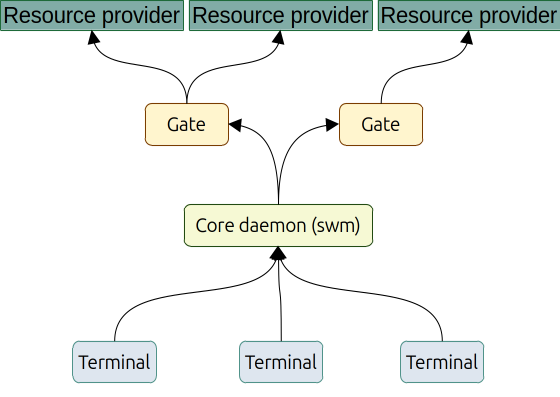

## The project

Open Workload is an effort initiated from desire to craft a standard for a modern High Performance Computing (HPC) workload management. Our project Sky Port is a prove of concept of tools that allows user facing software to have transparent access to multiple cloud compute resources with a single API.

In other words we try to work through and sharpen a universal bus between user software and cloud resources. But our final goal is to present a new standard that would describe a transportation layer between any workload producer (user software) and resource providers (cloud or HPC clusters).

We believe in zero trust approach and follow its principles in our source code. 

## Current status

The source code of Sky Port can be considered as a reference and a prove of concept for a future standard. The project is started recently and requires some time for the API stabilization. Thus one can consider the code for now as a highly experimental one.

## Source code

Sky Port project consists of the following repositories:
* [Core daemon](https://github.com/openworkload/swm-core): the core component of Sky Port. This is a daemon that runs in background and serve all communications among terminals and gates.
* [Scheduler](https://github.com/openworkload/swm-sched): workload scheduler for the core daemon.
* [Cloud gate](https://github.com/openworkload/swm-cloud-gate): a cloud plugin for Sky Port that is in charge of all communications with cloud providers.
* [Jupyter terminal](https://github.com/openworkload/swm-jupyter-term): JupyterHub spawner to run Jupyter servers via Sky Port. 
* [Console terminal](https://github.com/openworkload/swm-console-term): console program that uses Sky Port python clinet libary to work with Sky Port workload and resources.
* [Python client library](https://github.com/openworkload/swm-python-client): wrapper around client REST API of the core component.

The following schema shows relationships among the Sky Port components.

The idea of the components separation is the following: APIs of the Core and the Gate are well described. Thus they can be replaced to more suitable for a user problem ones. Terminals can be created by 3rd party software developres for specific user needs, like a submittion of Jupyter servers jobs. Cloud provider owners can create gates for their compute resources and share among the users.

## Contributing

We appreciate all contributions. If you are planning to contribute back bug-fixes, please do so without any further discussion. If you plan to contribute new features, utility functions or extensions, please first open an issue and discuss the feature with us.

We use a shared copyright model that enables all contributors to maintain the copyright on their contributions. All the software we develop is licensed under the BSD-3-Clause license.
